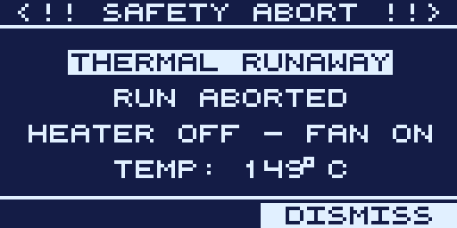

# Safety Features

This firmware controls a roughly 1500 W heater with no human in the loop during a
run, so ReflowOS layers on several independent protections. None of them replace
supervision. Never leave a running oven unattended, and keep an extinguisher
nearby.

- [Thermal runaway protection](#thermal-runaway-protection)
- [Absolute over-temperature cutoff](#absolute-over-temperature-cutoff)
- [Heater and sensor fault cutoff](#heater-and-sensor-fault-cutoff)
- [Thermocouple disagreement cutoff](#thermocouple-disagreement-cutoff)
- [Cooling rate control](#cooling-rate-control)
- [Watchdog](#watchdog)
- [Safe shutdown paths](#safe-shutdown-paths)
- [What to check on your oven](#what-to-check-on-your-oven)

---

## Thermal runaway protection

During a reflow or bake, if the measured temperature climbs past the setpoint plus
your runaway threshold (setting #14, *Runaway thresh*, 30 °C by default), the
firmware acts at once.

It turns the heater off, turns the fan on, sounds the alarm buzzer, shows the
runaway alert, and returns to standby. Press any key to dismiss it. Setting the
threshold to `OFF` disables this relative check, but the absolute cutoff below
still applies.

---

## Absolute over-temperature cutoff

Separate from the setpoint-relative check, ReflowOS aborts if the measured
temperature ever passes an absolute ceiling of 280 °C. This is a hard backstop. It
fires even when the setpoint is corrupt or implausibly high, which catches a class
of failure the relative check cannot. You cannot disable it.

---

## Heater and sensor fault cutoff

If the heater is commanded to full power for 30 seconds but the temperature has not
risen by at least 5 °C, the firmware cuts the heat and aborts the run (heater off,
fan on, alarm, and a "HEATER/SENSOR" abort screen). This catches two dangerous
failures at once:

- A dead heater, failed SSR, or disconnected element.
- A control thermocouple reading low while the oven is actually hot (loose or
  broken connector). This is the most dangerous failure of all, because the PID
  would otherwise keep driving full heat into a real runaway that the
  setpoint-relative check cannot see. A working oven ramps far faster than
  5 °C in 30 s at full power, so this never false-trips.

## Thermocouple disagreement cutoff

During a run, if the two control thermocouples disagree by more than 60 °C, one of
them is faulty, so the firmware aborts (showing "TC DISAGREE") rather than
regulate against a bad average.

---

## Cooling rate control

Cooling a board too fast causes thermal shock and cracked joints. If you set
**Max cool rate** (setting #16), the firmware limits the fan so the measured
cooldown does not exceed that rate (0.1 to 5.0 °C/s). `UNLIMIT` turns the limit
off.

---

## Watchdog

A hardware watchdog resets the MCU if the firmware ever stops servicing its main
loop, so a software hang cannot leave the heater stuck on. The firmware feeds the
watchdog on its normal schedule throughout every operation.

---

## Safe shutdown paths

- Stopping or aborting (`stop`, or **S** on the reflow or bake screen) always drives
  the heater to 0 before returning to standby.
- Entering the bootloader (`enter isp`, or holding F1 at boot) forces the heater and
  fan pins off before jumping to the ROM bootloader, so the oven does not heat while
  it waits to be reflashed.
- Any mode change back to standby turns the heater off.

---

## What to check on your oven

Firmware can only react to what it measures. The following are your job, and they
matter more than any software feature:

- **Thermocouples.** They should be mounted, intact, and reading the real board or
  cavity temperature. A thermocouple that reads low while the oven is hot used to
  be the most dangerous failure mode; the heater/sensor fault cutoff above now
  catches it, but a bad reading still spoils your reflow, so verify readings
  against an independent thermometer after you install and calibrate (see
  [Calibration](CALIBRATION.md)).
- **Cold-junction sensor.** Fit a DS18B20 (or DS18S20/DS1822). Without it the
  firmware assumes a fixed ambient, which hurts accuracy.
- **Mains earth.** Confirm the protective earth contacts the chassis and that both
  halves are bonded.
- **Wiring and SSR.** Inspect for heat damage. A welded-closed SSR defeats every
  software cutoff. The fan-on and alarm still fire, but the element stays powered.
- **Ventilation and attendance.** Run in a ventilated space and stay with the oven.

> Use at your own risk. This firmware is provided without warranty of any kind. See
> the disclaimer in the main [README](../README.md).
