# User Guide: On-Oven Interface

This page covers everything the firmware does from the front panel: every screen,
every key, and how to run a reflow, bake a board, edit a profile, and calibrate.

All the screenshots here are rendered from the real firmware running in the
[host simulator](BUILDING.md#for-developers-the-host-simulator), so they match the
pixels you see on the oven's 128x64 LCD.

- [The keypad](#the-keypad)
- [Main menu](#main-menu)
- [Running a reflow](#running-a-reflow)
- [Bake / manual mode](#bake--manual-mode)
- [Selecting a profile](#selecting-a-profile)
- [Editing a custom profile](#editing-a-custom-profile)
- [Setup / calibration menu](#setup--calibration-menu)
- [Auto-tune screens](#auto-tune-screens)
- [About screen](#about-screen)
- [Screensaver](#screensaver)

---

## The keypad

The oven has five keys. What each one does changes from screen to screen, and the
current meaning is always labelled on-screen in an inverted (white) box next to
the option it controls.

| Key | Typical role |
|-----|--------------|
| **F1** | Left, previous, or decrease |
| **F2** | Right, next, increase, or toggle display |
| **F3** | Adjust down (context dependent) |
| **F4** | Adjust up (context dependent) |
| **S** | Select, Start, Stop, or Back |

Holding a key repeats the action, and the repeat accelerates the longer you hold.
That applies when you adjust a setpoint, a timer, or a profile value.

---

## Main menu

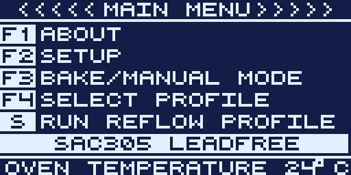

This is the home screen. Each row maps to a key:

| Key | Action |
|-----|--------|
| **F1** | [About](#about-screen) |
| **F2** | [Setup / calibration](#setup--calibration-menu) |
| **F3** | [Bake / manual mode](#bake--manual-mode) |
| **F4** | [Select profile](#selecting-a-profile) |
| **S** | [Run reflow](#running-a-reflow) with the selected profile |

The bottom two lines show the currently selected profile (highlighted) and the
live oven temperature in your chosen unit, either °C or °F.

---

## Running a reflow

Press **S** from the main menu to start a reflow with the selected profile.

### Preheat

If you have set a preheat temperature (Setup, then *Preheat temp*), the oven first
heats to that temperature and holds before the profile clock starts. The header
reads `PREHEAT` while this happens. The profile always begins at its first point
the moment preheat finishes, so the opening ramp and soak are never skipped.

### Live reflow view

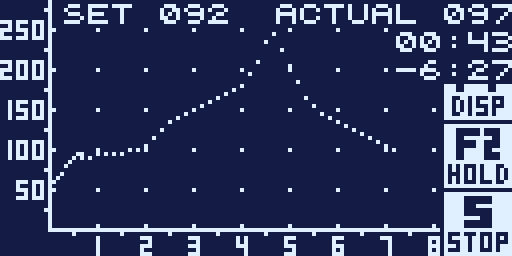

Reading the screen:

- **SET** is the current profile target. It blinks when the oven is more than 5 °C
  below target.
- **ACTUAL** is the measured oven temperature. It blinks when the oven is more than
  5 °C above target.
- Top right shows elapsed time as `MM:SS`, and below it the time remaining as
  `-MM:SS`. The leading dash marks it as a countdown, not a negative number.
- The graph draws the target profile as a dotted line with your live temperature
  traced over it, left to right.
- **F2 (HOLD)** pauses the profile clock so heat can soak at the current setpoint.
- **S (STOP)** aborts the run and returns to standby with the heater off.

Press **F1** to switch to the big-number view, which shows setpoint, actual
temperature, and remaining time as large digits with bar graphs. It is easier to
read from across the room.

### Peak and completion

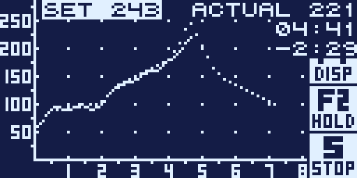

When the profile finishes, the oven turns the heater off, sounds the completion
buzzer, and shows the post-reflow analytics:

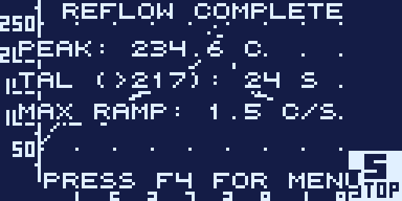

| Metric | Meaning |
|--------|---------|
| **PEAK** | Highest temperature reached during the run |
| **TAL (>217)** | Time above liquidus, in seconds spent above 217 °C (the SAC305 liquidus point) |
| **MAX RAMP** | Fastest heating rate observed, in °C/s |

These same analytics are also tracked during a bake, not just a reflow.

Press **S** to return. (The screen reads "Press F4 for menu", but only **S**
actually dismisses it.) Use these numbers to judge whether the run matched the
reflow spec for your solder paste.

### If something goes wrong

If the temperature climbs past setpoint plus your runaway threshold, or past the
absolute 280 °C ceiling regardless of setpoint, the firmware aborts at once. It
turns the heater off, turns the fan on, sounds the alarm, and shows this screen.
Press any key to dismiss it. The [Safety guide](SAFETY.md) lists every protection.

---

## Bake / manual mode

Press **F3** from the main menu. Bake mode holds a fixed temperature, which is
handy for drying boards, curing, or preheating.

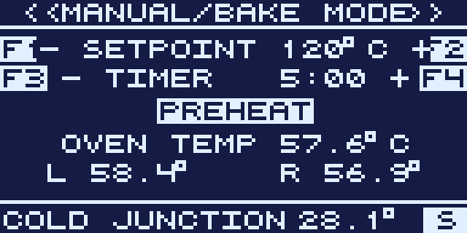

| Key | Action |
|-----|--------|
| **F1 / F2** | Decrease or increase the setpoint (30 to 300 °C) |
| **F3 / F4** | Decrease or increase the timer |
| **S** | Stop and return to the menu |

The timer has three states, shown in the display:

- A positive time counts down, but only after the oven reaches setpoint (it shows
  `PREHEAT` until then). When it expires the oven beeps and returns to standby.
- `inf TIMER` (timer at zero) holds the temperature indefinitely until you stop it.
- `no timer` (timer below zero) also holds indefinitely, with no countdown shown.

Timers up to 36 hours are supported and expire reliably, so an overnight bake
shuts itself off. Alongside the main oven temperature, the screen also shows the
left and right thermocouples, the cold-junction temperature, and the extra X1/X2
thermocouples if you have them fitted.

The display honours your temperature unit setting. In Fahrenheit mode the setpoint
and all readings appear in °F, while the oven is still controlled correctly
underneath:

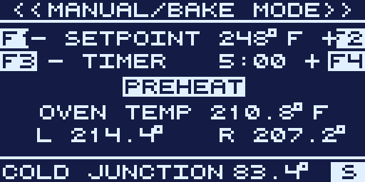

---

## Selecting a profile

Press **F4** from the main menu.

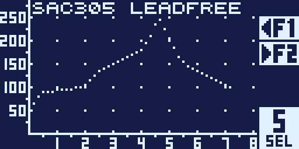

- **F1 / F2** cycle through every available profile (built-in, custom, and
  flash-stored), wrapping around at both ends.
- The selected profile's curve is plotted, so you can eyeball the ramp, soak, peak,
  and cooldown before you commit.
- **S** selects the profile and returns to the menu.

For the two editable CUSTOM profiles, an **F3 (EDIT)** button also appears:

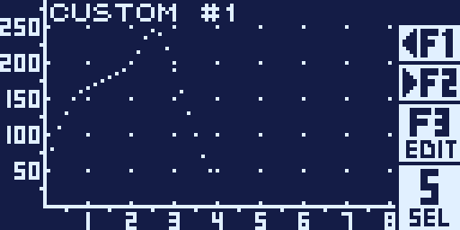

The [Profiles guide](PROFILES.md) has the full list of built-in profiles and
explains how custom and flash storage work.

---

## Editing a custom profile

From the profile selector, choose CUSTOM #1 or CUSTOM #2 and press **F3**.

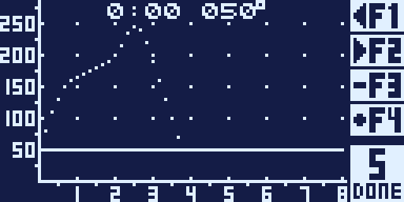

A profile is 48 setpoints spaced 10 seconds apart, so it runs from 0:00 to 7:50
(470 seconds).

| Key | Action |
|-----|--------|
| **F1 / F2** | Move the cursor to the previous or next time point |
| **F3 / F4** | Lower or raise the setpoint at the cursor (0 to 300 °C) |
| **S** | Save to EEPROM and return |

The header shows the cursor's time (`M:SS`) and setpoint, and the curve redraws as
you edit. Setting a point (and everything after it) to 0 ends the profile early.
Edits are written to EEPROM, so they survive power cycles. They do not survive a
firmware update, so run [`backup`](SERIAL.md#backup-and-restore) first.

---

## Setup / calibration menu

Press **F2** from the main menu.

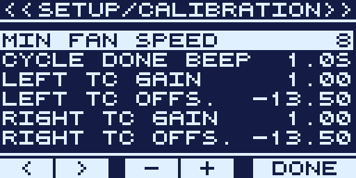

| Key | Action |
|-----|--------|
| **F1 / F2** | Previous or next setting (the list scrolls) |
| **F3 / F4** | Decrease or increase the highlighted value (hold to accelerate) |
| **S** | On most rows this exits to the menu. On calibration and tune rows it launches that routine (see below). |

Scroll down for the thermocouple calibration and control-tuning rows:

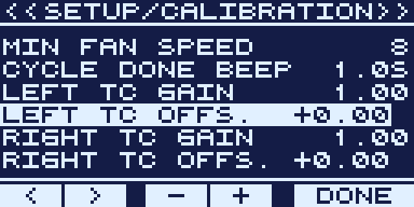

At the very bottom is a Factory Reset entry. Press **S** on it to restore all
settings to their defaults:

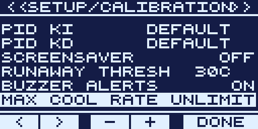

The [Settings Reference](SETTINGS.md) documents every setting.

### Launching calibration from the menu

On certain rows, pressing **S** starts a routine instead of exiting:

- The **ambient Left/Right TC offset** rows (#3 and #5, not the hi-off rows)
  launch [TC offset auto-calibration](CALIBRATION.md#thermocouple-offset-auto-calibration).
- The **bang-bang** rows (#7 to #9, when bang-bang mode is on) launch
  [bang-bang auto-tune](CALIBRATION.md#bang-bang-auto-tune).
- The **PID** rows (#10 to #12, when bang-bang mode is off) launch
  [PID auto-tune](CALIBRATION.md#pid-auto-tune).

---

## Auto-tune screens

Both auto-tune routines open with a confirmation prompt:

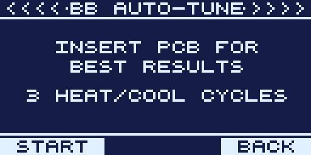

Insert a scrap PCB so the oven has representative thermal mass, then press
**F1 (START)**, or **S (BACK)** to cancel. The tune then runs several heat and cool
cycles with a live temperature graph:

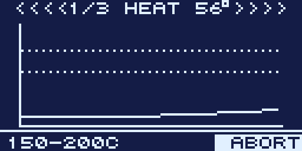

The header shows the cycle count and current phase (`HEAT`, `COOL`, and so on), the
dotted lines mark the target band, and the solid trace is the live temperature.
PID tuning, which uses the Ziegler-Nichols relay method, works the same way:

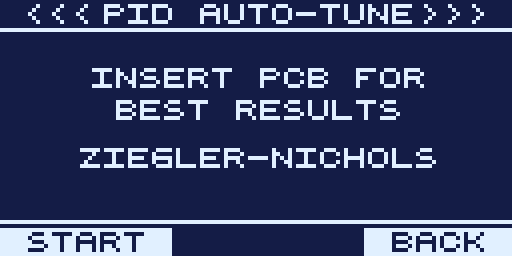
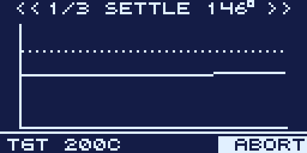

Auto-tune has a built-in timeout. If any phase stalls, for example because the
oven cannot reach the target, it aborts cleanly with the heater off rather than
hanging. The [Calibration guide](CALIBRATION.md) has the full story.

---

## About screen

Press **F1** from the main menu.

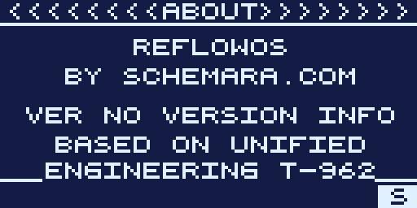

It shows the firmware name, maintainer, build version, and upstream credit. Press
**S** (or any key) to return. On a real build the `VER` line shows the git version
stamped in at compile time.

---

## Screensaver

If **Screensaver mins** (Setup) is set to a non-zero value, an animated Pac-Man
screensaver takes over after that many minutes of inactivity, complete with
chasing ghosts and a score counter. Any keypress returns you to the menu. Set it
to `OFF` to disable it.

The setting takes effect the next time you return to the main menu (or on the
next boot), so after changing it in Setup, back out to the menu.
